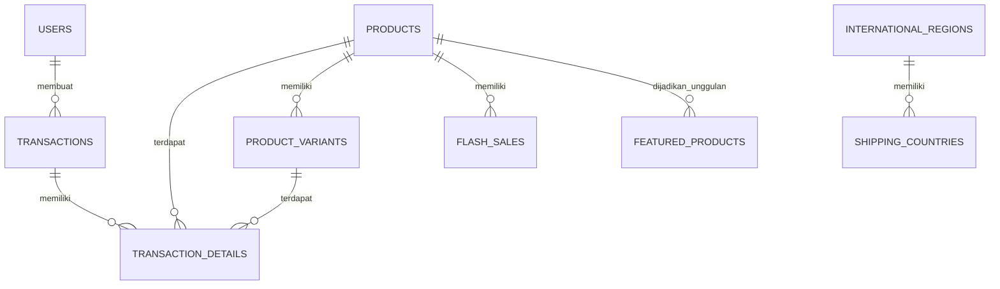

<div align="center">

# ALGO NATION

**Website E-Commerce Pakaian**

Sistem e-commerce lengkap untuk penjualan pakaian dengan fitur produk, keranjang belanja, checkout, pembayaran Midtrans, pengiriman berbasis jarak, flash sale, produk unggulan, dan panel admin.

</div>

---

## Daftar Isi

1. [Tentang ALGO NATION](#1-algo-nation)
2. [Fitur Utama](#2-fitur-utama)
3. [Teknologi yang Digunakan](#3-teknologi-yang-digunakan)
4. [Struktur Project](#4-struktur-project)
5. [Persyaratan Sistem](#5-persyaratan-sistem)
6. [Instalasi Project](#6-instalasi-project)
7. [Konfigurasi Environment](#7-konfigurasi-environment)
8. [Database](#8-database)
9. [ERD Sederhana](#9-erd-sederhana)
10. [Authentication](#10-authentication)
11. [Sistem Produk](#11-sistem-produk)
12. [Sistem Produk Unggulan](#12-sistem-produk-unggulan)
13. [Sistem Flash Sale](#13-sistem-flash-sale)
14. [Sistem Keranjang](#14-sistem-keranjang)
15. [Sistem Ongkir](#15-sistem-ongkir)
16. [Sistem Checkout](#16-sistem-checkout)
17. [Sistem Pembayaran](#17-sistem-pembayaran)
18. [Webhook / Notification Payment](#18-webhook--notification-payment)
19. [Status Pesanan](#19-status-pesanan)
20. [Admin Dashboard](#20-admin-dashboard)
21. [Customer Service WhatsApp](#21-customer-service-whatsapp)
22. [Alur Sistem Keseluruhan](#22-alur-sistem-keseluruhan)
23. [Validasi](#23-validasi)
24. [Error Handling](#24-error-handling)
25. [Testing](#25-testing)
26. [Troubleshooting](#26-troubleshooting)
27. [Perintah Penting](#27-perintah-penting)
28. [Deployment](#28-deployment)
29. [Environment Development dan Production](#29-environment-development-dan-production)
30. [Catatan Pengembangan](#30-catatan-pengembangan)
31. [Lisensi](#31-lisensi)
32. [Kontributor](#32-kontributor)

---

## 1. ALGO NATION

ALGO NATION adalah website e-commerce yang menjual produk pakaian dan aksesoris. Website ini dirancang untuk memberikan pengalaman belanja online yang mudah dan profesional bagi customer, serta menyediakan panel administrasi yang lengkap bagi admin untuk mengelola seluruh aspek toko online.

**Tujuan website:**

* Menjadi platform penjualan produk pakaian secara online.
* Customer dapat melihat, mencari, dan memfilter produk berdasarkan kategori.
* Customer dapat membeli produk melalui alur checkout yang terstruktur.
* Customer dapat menggunakan keranjang belanja untuk mengumpulkan produk sebelum checkout.
* Customer dapat melakukan pembayaran secara online melalui payment gateway Midtrans.
* Customer dapat melihat riwayat pesanan dan status pengiriman.
* Customer dapat memanfaatkan flash sale untuk mendapatkan harga spesial.
* Admin dapat mengelola produk, varian produk, stok, pesanan, pengiriman, flash sale, produk unggulan, pengguna, dan laporan penjualan.

---

## 2. Fitur Utama

### User (Customer)

* Registrasi akun baru
* Login / logout
* Melihat semua produk di halaman toko (shop)
* Mencari produk berdasarkan nama
* Memfilter produk berdasarkan kategori
* Melihat detail produk (gambar, deskripsi, harga, varian, stok)
* Melihat produk unggulan
* Melihat halaman flash sale dengan countdown timer
* Menambahkan produk ke keranjang belanja
* Mengubah jumlah item di keranjang
* Menghapus item dari keranjang
* Melihat subtotal dan total di keranjang
* Melakukan checkout dengan alamat pengiriman
* Memperkirakan biaya ongkir sebelum checkout
* Melakukan pembayaran via Midtrans Snap (popup)
* Melihat riwayat pesanan
* Melihat detail pesanan beserta timeline pelacakan
* Membayar pesanan yang belum dibayar (re-pay)
* Membatalkan pesanan (dengan batas waktu)
* Melihat struk/bukti pembayaran
* Mengelola profil (nama, username, email)
* Mengubah password
* Lupa password / reset password via email (dengan rate limiting dan anti-enumeration)

### Admin

* Login admin (dengan role-based access control)
* Dashboard admin dengan statistik pendapatan, jumlah pesanan, produk, dan pengguna
* Grafik pendapatan harian (7, 30, 90 hari)
* Grafik status pembayaran (doughnut chart)
* Daftar produk dengan stok rendah
* Daftar pengguna terbaru
* CRUD produk (tambah, edit, hapus)
* Upload gambar produk
* Kelola varian produk (tambah, edit, hapus varian)
* Kelola stok produk dan varian
* Laporan stok (semua, stok rendah, habis)
* CRUD flash sale (tambah, edit, hapus, toggle status)
* CRUD produk unggulan (tambah, edit, hapus)
* Melihat daftar pesanan dengan pencarian dan filter
* Melihat detail pesanan
* Mengupdate informasi pengiriman (kurir, nomor resi, status, tanggal)
* Laporan penjualan dengan filter rentang tanggal
* Export laporan penjualan ke CSV
* Cetak laporan penjualan
* Kelola pengguna (lihat, tambah, ubah role, aktifkan/nonaktifkan)
* Pengaturan pengiriman (asal toko, zona domestik, region internasional, negara, kurir)

---

## 3. Teknologi yang Digunakan

| Teknologi | Fungsi |
|---|---|
| PHP 8.2+ | Bahasa pemrograman backend |
| Laravel 12 | Framework backend PHP |
| MySQL | Database relasional |
| Blade Templates | Templating engine untuk view |
| Tailwind CSS 4 | Framework CSS untuk styling |
| Alpine.js 3 | Library JavaScript untuk interaktivitas frontend |
| Vite 7 | Build tool dan development server |
| Chart.js 4 | Library grafik untuk dashboard admin |
| Axios | HTTP client untuk request API (AJAX) |
| Midtrans PHP SDK | Integrasi payment gateway Midtrans |
| OSRM | Routing engine untuk perhitungan jarak pengiriman |
| Nominatim | Geocoding service untuk konversi alamat ke koordinat |
| Pest 3 | Testing framework (PHP) |
| Session (File) | Manajemen sesi user |

---

## 4. Struktur Project

```text
ALGO-NATION/
├── app/
│   ├── Http/
│   │   ├── Controllers/
│   │   │   ├── Admin/
│   │   │   │   ├── AdminController.php
│   │   │   │   ├── FeaturedProductController.php
│   │   │   │   ├── FlashSaleController.php
│   │   │   │   ├── OrderController.php
│   │   │   │   ├── ProductController.php
│   │   │   │   ├── SalesController.php
│   │   │   │   ├── ShippingController.php
│   │   │   │   ├── StockController.php
│   │   │   │   └── UserController.php
│   │   │   ├── Auth/
│   │   │   │   ├── ForgotPasswordController.php
│   │   │   │   └── ResetPasswordController.php
│   │   │   ├── AuthController.php
│   │   │   ├── CartController.php
│   │   │   ├── CheckoutController.php
│   │   │   ├── Controller.php
│   │   │   ├── HomeController.php
│   │   │   ├── ProfileController.php
│   │   ├── Middleware/
│   │   │   └── AdminMiddleware.php
│   │   └── Requests/
│   ├── Mail/
│   │   └── ResetPasswordMail.php
│   ├── Models/
│   │   ├── FeaturedProduct.php
│   │   ├── FlashSale.php
│   │   ├── InternationalRegion.php
│   │   ├── Product.php
│   │   ├── ProductVariant.php
│   │   ├── ShippingCountry.php
│   │   ├── ShippingCourier.php
│   │   ├── ShippingSetting.php
│   │   ├── ShippingZone.php
│   │   ├── Transaction.php
│   │   ├── TransactionDetail.php
│   │   └── User.php
│   ├── Providers/
│   │   └── AppServiceProvider.php
│   └── Services/
│       ├── CartService.php
│       ├── OrderService.php
│       ├── PaymentService.php
│       ├── SalesReportingService.php
│       └── ShippingService.php
├── bootstrap/
├── config/
│   ├── app.php
│   ├── auth.php
│   ├── cache.php
│   ├── database.php
│   ├── filesystems.php
│   ├── logging.php
│   ├── mail.php
│   ├── midtrans.php
│   ├── queue.php
│   ├── services.php
│   └── session.php
├── database/
│   ├── factories/
│   │   └── UserFactory.php
│   ├── migrations/
│   └── seeders/
│       ├── DatabaseSeeder.php
│       └── ShippingSeeder.php
├── public/
│   ├── build/
│   ├── images/
│   ├── storage/
│   ├── .htaccess
│   ├── favicon.ico
│   ├── index.php
│   └── robots.txt
├── resources/
│   ├── css/
│   │   └── app.css
│   ├── js/
│   │   ├── app.js
│   │   └── bootstrap.js
│   └── views/
│       ├── layouts/
│       ├── partials/
│       ├── components/
│       ├── auth/
│       │   ├── forgot-password.blade.php
│       │   ├── login.blade.php
│       │   ├── register.blade.php
│       │   └── reset-password.blade.php
│       ├── admin/
│       ├── products/
│       ├── checkout/
│       ├── emails/
│       ├── orders/
│       ├── profile/
│       ├── landing.blade.php
│       ├── shop.blade.php
│       ├── featured.blade.php
│       ├── flash-sale.blade.php
│       └── about.blade.php
├── routes/
│   ├── web.php
│   └── console.php
├── storage/
├── tests/
├── vendor/
├── .env
├── artisan
├── composer.json
├── package.json
├── phpunit.xml
└── vite.config.js
```

**Keterangan folder penting:**

| Folder | Fungsi |
|---|---|
| `app/Http/Controllers/Admin/` | Controller admin (9 file) |
| `app/Http/Controllers/` | Controller publik dan auth (6 file + `Auth/` 2 file) |
| `app/Mail/` | Mailable Laravel (`ResetPasswordMail.php`) |
| `app/Models/` | Model Eloquent (12 file) |
| `app/Services/` | Service layer (5 file) |
| `config/midtrans.php` | Konfigurasi custom Midtrans |
| `config/services.php` | Konfigurasi WhatsApp CS, OSRM, Nominatim |
| `database/migrations/` | 17 file migrasi database |
| `database/seeders/` | Seeder data awal |
| `resources/views/admin/` | Template halaman admin |
| `resources/js/app.js` | Alpine.js stores, keranjang, countdown, Midtrans |
| `resources/css/app.css` | Tailwind CSS + custom design system |
| `routes/web.php` | Semua route aplikasi |

---

## 5. Persyaratan Sistem

| Software | Versi | Keterangan |
|---|---|---|
| PHP | >= 8.2 | Bahasa backend Laravel 12 |
| Composer | Latest | Dependency manager PHP |
| Node.js | >= 18 | Untuk build frontend (Vite) |
| npm | Latest | Package manager Node.js |
| MySQL | >= 5.7 | Database |
| Git | Latest | Version control |
| Browser | Modern | Chrome, Firefox, Edge, Safari (latest) |

---

## 6. Instalasi Project

### 1. Clone Repository

```bash
git clone https://github.com/Bahtraaa/algonation
cd algonation
```

### 2. Install Dependency PHP

```bash
composer install
```

### 3. Install Dependency Frontend

```bash
npm install
```

### 4. Buat File Environment

```bash
cp .env.example .env
```

> Jika tidak ada `.env.example`, salin file `.env` yang sudah ada dan hapus credential asli.

### 5. Generate Application Key

```bash
php artisan key:generate
```

### 6. Buat Database

Buat database MySQL bernama `algonation` (atau sesuai konfigurasi `.env`):

```sql
CREATE DATABASE algonation;
```

### 7. Jalankan Migrasi

```bash
php artisan migrate
```

### 8. Jalankan Seeder

```bash
php artisan db:seed
```

### 9. Buat Storage Symlink

```bash
php artisan storage:link
```

### 10. Build Frontend

```bash
npm run build
```

### 11. Jalankan Development Server

```bash
php artisan serve
```

Server akan berjalan di `http://localhost:8000` (atau `http://e-commerce.test` jika menggunakan Laragon).

---

## 7. Konfigurasi Environment

File `.env` berisi konfigurasi utama project. Berikut variable-variable yang digunakan:

### Application

```env
APP_NAME="ALGO NATION"
APP_ENV=local
APP_KEY=base64:...
APP_DEBUG=true
APP_URL=http://e-commerce.test
APP_LOCALE=en
APP_FALLBACK_LOCALE=en
APP_FAKER_LOCALE=en_US
APP_MAINTENANCE_DRIVER=file
```

### Database

```env
DB_CONNECTION=mysql
DB_HOST=127.0.0.1
DB_PORT=3306
DB_DATABASE=algonation
DB_USERNAME=root
DB_PASSWORD=
```

### Session

```env
SESSION_DRIVER=file
SESSION_LIFETIME=120
SESSION_ENCRYPT=false
SESSION_PATH=/
SESSION_DOMAIN=
```

### Email Reset Password (SMTP Resend)

Reset password dikirim melalui **Laravel Mail / Mailable** (`App\Mail\ResetPasswordMail`)
menggunakan **SMTP Resend** (`config/mail.php` mailer `smtp`). Kredensial hanya
berada di `.env` dan tidak pernah di-hardcode di kode maupun di-commit ke repository.

```env
MAIL_MAILER=smtp
MAIL_HOST=smtp.resend.com
MAIL_PORT=587
MAIL_USERNAME=resend
MAIL_PASSWORD=re_xxxxxxxxx
MAIL_ENCRYPTION=tls
MAIL_FROM_ADDRESS=onboarding@resend.dev
MAIL_FROM_NAME="Acme"
```

Pengiriman dilakukan dengan pola:

```php
use Illuminate\Support\Facades\Mail;

Mail::to($user->email)->send(new ResetPasswordMail($user, $resetUrl));
```

Tidak menggunakan Mailtrap, Resend Email API langsung, maupun Java SDK.
Tidak ada tabel database baru untuk fitur ini: token reset dan rate limit
disimpan di **Cache** (`CACHE_STORE=database`, tabel `cache` yang sudah ada).

Setelah mengubah `.env`, bersihkan konfigurasi:

```bash
php artisan config:clear
```

### Midtrans (Payment Gateway)

```env
MIDTRANS_SERVER_KEY=Mid-server-XXXXXXXXXXXXXXXXXXXX
MIDTRANS_CLIENT_KEY=Mid-client-XXXXXXXXXXXXXXXXXXXX
MIDTRANS_IS_PRODUCTION=false
MIDTRANS_IS_SANITIZED=true
MIDTRANS_IS_3DS=true
```

| Variable | Keterangan |
|---|---|
| `MIDTRANS_SERVER_KEY` | Server key dari Midtrans (sandbox/production) |
| `MIDTRANS_CLIENT_KEY` | Client key dari Midtrans (sandbox/production) |
| `MIDTRANS_IS_PRODUCTION` | `false` untuk sandbox, `true` untuk production |
| `MIDTRANS_IS_SANITIZED` | Sanitasi input ke Midtrans API |
| `MIDTRANS_IS_3DS` | Aktifkan 3D Secure untuk pembayaran |

> **Catatan development lokal:** Webhook Midtrans (`POST /midtrans/notification`) tidak dapat diakses dari `localhost`. Untuk itu, verifikasi pembayaran tidak bergantung pada webhook: Snap `onSuccess` memicu endpoint `orders.finalize` (verifikasi signature), dan halaman struk mem-poll `orders.check-status`. Webhook tetap menjadi jalur kanonik di production.

### WhatsApp Customer Service

```env
VITE_WHATSAPP_CS_NUMBER=628xxxxxxxxxxx
```

Nomor WhatsApp Customer Service. Diakses dari frontend melalui `import.meta.env.VITE_WHATSAPP_CS_NUMBER`.

### Shipping / Routing

```env
SHIPPING_ROUTING_ENDPOINT=https://router.project-osrm.org
SHIPPING_ROUTING_MODE=driving
SHIPPING_GEOCODING_ENDPOINT=https://nominatim.openstreetmap.org
```

| Variable | Keterangan |
|---|---|
| `SHIPPING_ROUTING_ENDPOINT` | Endpoint OSRM untuk routing jarak pengiriman |
| `SHIPPING_ROUTING_MODE` | Mode routing (`driving`) |
| `SHIPPING_GEOCODING_ENDPOINT` | Endpoint Nominatim untuk geocoding alamat |

### Cache & Queue

```env
CACHE_STORE=database
QUEUE_CONNECTION=database
```

### Lainnya

```env
BCRYPT_ROUNDS=12
LOG_CHANNEL=stack
LOG_STACK=single
LOG_DEPRECATIONS_CHANNEL=null
LOG_LEVEL=debug
FILESYSTEM_DISK=local
BROADCAST_CONNECTION=log
```

> **PENTING:** Jangan pernah memasukkan API key, password, atau credential asli ke dalam repository. Selalu gunakan placeholder di file `.env.example`.

---

## 8. Database

### Nama Database

`algonation` (MySQL)

### Daftar Tabel

| Tabel | Fungsi |
|---|---|
| `users` | Data pengguna (customer dan admin) |
| `products` | Data produk utama |
| `product_variants` | Varian produk (ukuran, warna, dll) |
| `transactions` | Data pesanan/transaksi |
| `transaction_details` | Detail item dalam pesanan |
| `flash_sales` | Data flash sale |
| `featured_products` | Data produk unggulan |
| `shipping_settings` | Pengaturan asal pengiriman (lokasi toko) |
| `shipping_zones` | Zona pengiriman domestik (berbasis jarak) |
| `international_regions` | Region internasional (Asia, Eropa, dll) |
| `shipping_countries` | Negara tujuan pengiriman internasional |
| `shipping_couriers` | Daftar kurir pengiriman |
| `cache` | Cache application (termasuk token reset password & rate limit forgot password) |
| `cache_locks` | Lock cache |
| `jobs` | Antrian job |
| `job_batches` | Batch job |
| `failed_jobs` | Job yang gagal |

> Fitur lupa password **tidak membuat tabel baru**. Token reset (`password-reset:{sha256(token)}`,
> TTL 30 menit, sekali pakai) dan rate limit (`forgot-password:{email}` / `forgot-password:ip:{ip}`)
> disimpan di Cache. Password baru langsung disimpan ke `users.password` (hash).

### Struktur Tabel Utama

#### `users`

| Kolom | Tipe | Keterangan |
|---|---|---|
| `id` | bigint (PK) | Auto-increment |
| `name` | string | Nama pengguna |
| `username` | string, nullable, unique | Username |
| `email` | string, unique | Email |
| `email_verified_at` | timestamp, nullable | Waktu verifikasi email |
| `password` | string | Password (hashed) |
| `role` | string, default `'user'` | Role: `admin` atau `user` |
| `status` | string, default `'active'` | Status: `active` atau `suspended` |
| `remember_token` | string, nullable | Token "ingat saya" |
| `created_at` / `updated_at` | timestamps | Timestamp otomatis |

#### `products`

| Kolom | Tipe | Keterangan |
|---|---|---|
| `id` | bigint (PK) | Auto-increment |
| `name` | string | Nama produk |
| `category` | string, indexed | Kategori produk |
| `image` | string, nullable | Path gambar produk |
| `description` | text, nullable | Deskripsi produk |
| `stock` | integer, default 0 | Stok utama |
| `price` | decimal(12,2), default 0 | Harga produk |
| `weight` | decimal(10,2), nullable | Berat produk (gram) |
| `length` | decimal(10,2), nullable | Panjang kemasan (cm) |
| `width` | decimal(10,2), nullable | Lebar kemasan (cm) |
| `height` | decimal(10,2), nullable | Tinggi kemasan (cm) |
| `created_at` / `updated_at` | timestamps | Timestamp otomatis |

**Kategori produk yang tersedia:** `Formal Wear`, `Bottoms`, `Outerwear`, `Footwear`, `Accessories`, `Bags`, `Hats`, `Casual T-Shirt`

#### `product_variants`

| Kolom | Tipe | Keterangan |
|---|---|---|
| `id` | bigint (PK) | Auto-increment |
| `product_id` | foreignId | FK ke `products` (cascade delete) |
| `name` | string | Nama varian |
| `stock` | integer, default 0 | Stok varian |
| `price` | decimal(12,2), nullable | Harga varian (fallback ke harga produk) |
| `created_at` / `updated_at` | timestamps | Timestamp otomatis |

#### `transactions`

| Kolom | Tipe | Keterangan |
|---|---|---|
| `id` | bigint (PK) | Auto-increment |
| `user_id` | foreignId | FK ke `users` (cascade delete) |
| `total_price` | decimal(12,2), default 0 | Total harga produk |
| `shipping_cost` | decimal(12,2), default 0 | Biaya pengiriman |
| `payment_method` | string, default `'midtrans'` | Metode pembayaran |
| `midtrans_order_id` | string, nullable, unique | Order ID Midtrans |
| `midtrans_snap_token` | string, nullable | Snap token Midtrans |
| `shipping_address` | text | Alamat pengiriman |
| `shipping_type` | string, nullable | Tipe pengiriman (`domestic` / `international`) |
| `origin_country` | string, nullable | Negara asal (snapshot) |
| `destination_country` | string, nullable | Negara tujuan (snapshot) |
| `destination_city` | string, nullable | Kota tujuan (snapshot) |
| `destination_state` | string, nullable | Provinsi tujuan (snapshot) |
| `destination_postal_code` | string, nullable | Kode pos tujuan (snapshot) |
| `shipping_distance` | decimal(12,2), nullable | Jarak pengiriman (km) |
| `actual_weight` | decimal(12,2), nullable | Berat aktual (kg) |
| `volumetric_weight` | decimal(12,2), nullable | Berat volumetrik (kg) |
| `billable_weight` | decimal(12,2), nullable | Berat yang ditagihkan (kg) |
| `shipping_zone` | string, nullable | Nama zona pengiriman |
| `status` | string, default `'pending'` | Status pesanan |
| `payment_status` | string, default `'pending'` | Status pembayaran |
| `paid_at` | timestamp, nullable | Waktu pembayaran berhasil |
| `payment_due_at` | timestamp, nullable | Batas waktu pembayaran (15 menit) |
| `shipping_courier` | string, nullable | Nama kurir |
| `tracking_number` | string, nullable | Nomor resi |
| `shipping_status` | string, default `'menunggu_diproses'` | Status pengiriman |
| `estimated_delivery_start` | date, nullable | Estimasi pengiriman (mulai) |
| `estimated_delivery_end` | date, nullable | Estimasi pengiriman (akhir) |
| `shipped_at` | timestamp, nullable | Waktu dikirim |
| `delivered_at` | timestamp, nullable | Waktu diterima |
| `shipping_updated_at` | timestamp, nullable | Waktu update pengiriman terakhir |
| `created_at` / `updated_at` | timestamps | Timestamp otomatis |

#### `transaction_details`

| Kolom | Tipe | Keterangan |
|---|---|---|
| `id` | bigint (PK) | Auto-increment |
| `transaction_id` | foreignId | FK ke `transactions` (cascade delete) |
| `product_id` | foreignId | FK ke `products` (cascade delete) |
| `variant_id` | foreignId, nullable | FK ke `product_variants` (null on delete) |
| `quantity` | integer | Jumlah item |
| `subtotal` | decimal(12,2) | Subtotal item |
| `created_at` / `updated_at` | timestamps | Timestamp otomatis |

#### `flash_sales`

| Kolom | Tipe | Keterangan |
|---|---|---|
| `id` | bigint (PK) | Auto-increment |
| `product_id` | foreignId | FK ke `products` (cascade delete) |
| `normal_price` | decimal(12,2) | Harga normal |
| `sale_price` | decimal(12,2) | Harga flash sale |
| `discount_percentage` | decimal(5,2) | Persentase diskon |
| `stock` | unsignedInteger | Stok flash sale (terpisah dari stok produk) |
| `start_at` | datetime | Waktu mulai flash sale |
| `end_at` | datetime | Waktu berakhir flash sale |
| `status` | enum | `scheduled`, `active`, `expired`, `inactive` |
| `created_at` / `updated_at` | timestamps | Timestamp otomatis |

#### `featured_products`

| Kolom | Tipe | Keterangan |
|---|---|---|
| `id` | bigint (PK) | Auto-increment |
| `product_id` | foreignId, unique | FK ke `products` (cascade delete) |
| `created_at` / `updated_at` | timestamps | Timestamp otomatis |

#### `shipping_settings`

| Kolom | Tipe | Keterangan |
|---|---|---|
| `id` | bigint (PK) | Auto-increment |
| `origin_country` | string, default `'Indonesia'` | Negara asal toko |
| `origin_city` | string, nullable | Kota asal toko |
| `origin_latitude` | decimal(10,7), nullable | Latitude asal |
| `origin_longitude` | decimal(10,7), nullable | Longitude asal |
| `routing_provider` | enum, default `'none'` | Provider routing: `none`, `osrm`, `google`, `here`, `mapbox` |
| `enable_routing` | boolean, default false | Aktifkan routing jarak |
| `created_at` / `updated_at` | timestamps | Timestamp otomatis |

#### `shipping_zones`

| Kolom | Tipe | Keterangan |
|---|---|---|
| `id` | bigint (PK) | Auto-increment |
| `name` | string | Nama zona |
| `min_distance_km` | decimal(10,2), default 0 | Jarak minimum (km), mendukung desimal (contoh: `100,1`) |
| `max_distance_km` | decimal(10,2), nullable | Jarak maksimum (km), nullable = tanpa batas |
| `rate_per_kg` | decimal(12,2), default 0 | Tarif per kg |
| `min_charge` | decimal(12,2), default 0 | Biaya minimum |
| `active` | boolean, default true | Status aktif |
| `created_at` / `updated_at` | timestamps | Timestamp otomatis |

#### `international_regions`

| Kolom | Tipe | Keterangan |
|---|---|---|
| `id` | bigint (PK) | Auto-increment |
| `name` | string, unique | Nama region |
| `rate_per_kg` | decimal(12,2), default 0 | Tarif per kg |
| `min_charge` | decimal(12,2), default 0 | Biaya minimum |
| `created_at` / `updated_at` | timestamps | Timestamp otomatis |

#### `shipping_countries`

| Kolom | Tipe | Keterangan |
|---|---|---|
| `id` | bigint (PK) | Auto-increment |
| `region_id` | foreignId | FK ke `international_regions` (cascade delete) |
| `country` | string, unique | Nama negara |
| `rate_per_kg` | decimal(12,2), nullable | Tarif per kg (override region) |
| `min_charge` | decimal(12,2), nullable | Biaya minimum (override region) |
| `active` | boolean, default true | Status aktif |
| `created_at` / `updated_at` | timestamps | Timestamp otomatis |

#### `shipping_couriers`

| Kolom | Tipe | Keterangan |
|---|---|---|
| `id` | bigint (PK) | Auto-increment |
| `name` | string | Nama kurir |
| `type` | enum | `domestic` atau `international` |
| `active` | boolean, default true | Status aktif |
| `created_at` / `updated_at` | timestamps | Timestamp otomatis |

---

## 9. ERD Sederhana



**Relasi utama:**

* `User` --> `Transaction` : Satu user bisa membuat banyak transaksi (OneToMany)
* `Transaction` --> `TransactionDetail` : Satu transaksi memiliki banyak detail item (OneToMany)
* `Product` --> `TransactionDetail` : Satu produk bisa ada di banyak detail transaksi (OneToMany)
* `ProductVariant` --> `TransactionDetail` : Satu varian bisa ada di banyak detail transaksi (OneToMany)
* `Product` --> `ProductVariant` : Satu produk memiliki banyak varian (OneToMany)
* `Product` --> `FlashSale` : Satu produk bisa memiliki flash sale (OneToMany)
* `Product` --> `FeaturedProduct` : Satu produk bisa dijadikan produk unggulan (OneToOne)
* `InternationalRegion` --> `ShippingCountry` : Satu region memiliki banyak negara (OneToMany)

---

## 10. Authentication

### Sistem Login

ALGO NATION menggunakan sistem autentikasi berbasis **session** (file driver) dengan role-based access control (RBAC).

**Dua role pengguna:**

| Role | Keterangan |
|---|---|
| `user` | Customer biasa, dapat berbelanja dan mengelola profil |
| `admin` | Administrator, dapat mengakses panel admin |

### Akun Demo

Jalankan seeder terlebih dahulu agar akun demo berikut tersedia:

```bash
php artisan db:seed
```

Gunakan halaman login yang sama di `/login`.

| Akun | Email | Password | Setelah login |
|---|---|---|---|
| Admin | `adminalgo@gmail.com` | `sCvagg*0` | Dashboard admin (`/admin`) |
| User | `usernamealgo@gmail.com` | `kHabdj%88` | Halaman shop (`/shop`) |

> **Catatan keamanan:** akun dan password di atas hanya untuk development/demo. Ganti atau hapus kredensial tersebut sebelum deployment ke production.

### Alur Authentication

```text
User/Admin
    |
    v
Login Page (/login)
    |
    v
Input Email + Password
    |
    v
Validasi Credential
    |
    v
Cek Status Akun (active/suspended)
    |
    +--> Suspended --> Tidak bisa login
    |
    +--> Active
           |
           v
         Buat Session
           |
           v
         Cek Role
           |
           +--> admin --> Redirect ke /admin
           |
           +--> user  --> Redirect ke /shop
```

### Registrasi

```text
User
    |
    v
Register Page (/register)
    |
    v
Input: Name, Username, Email, Password, Confirm Password
    |
    v
Validasi Server-side
    |
    v
Buat Akun (role: 'user', status: 'active')
    |
    v
Auto Login
    |
    v
Redirect ke /shop
```

### Middleware

* **`auth`** : Middleware bawaan Laravel, memastikan user sudah login.
* **`admin`** : Custom middleware (`AdminMiddleware.php`), memastikan user memiliki role `admin`. Jika bukan admin, akan mengembalikan HTTP 403.

### Logout

```text
User/Klik Logout
    |
    v
POST /logout (auth middleware)
    |
    v
Hapus Session
    |
    v
Redirect ke halaman utama
```

### Lupa Password / Reset Password

Alur (`guest` middleware, CSRF aktif):

```text
Login Page --> "Forgot Password?" --> /forgot-password
    |
    v
Input Email --> Validasi --> Normalisasi (lowercase + trim)
    |
    v
Cek blokir email 30 menit --> Jika diblokir: TOLAK
    |
    v
Cek blokir IP --> Jika diblokir: TOLAK
    |
    v
Cek window 1 menit --> Jika >= 2 sukses: TOLAK + blokir email 30 menit
    |
    v
Buat token (random_bytes 32, disimpan sebagai SHA-256 di Cache, TTL 30 menit)
    |
    v
Kirim email via Mail::to()->send(new ResetPasswordMail) (SMTP Resend)
    |
    +--> Gagal --> hapus token, tanpa catat, tanpa blokir
    |
    +--> Berhasil --> catat request --> respons umum:
         "Jika email tersebut terdaftar, link reset password akan dikirim ke email tersebut."
    |
    v
User buka /reset-password/{token}?email=... --> input password baru + konfirmasi
    |
    v
Validasi token (valid, belum expired, belum dipakai) --> Hash::make --> users.password
    |
    v
Token dihapus (sekali pakai) --> redirect /login:
"Password berhasil diubah. Silakan login menggunakan password baru."
```

**Rate limit (backend, Cache, tanpa tabel baru):**

| Aturan | Nilai |
|---|---|
| Maksimal email reset berhasil per email | 2 dalam 60 detik (sliding window) |
| Request ke-3 dalam window | Ditolak, tanpa token, tanpa email, blokir email 30 menit |
| Selama blokir | Semua request email tersebut ditolak; counter tidak bertambah; blokir tidak diperpanjang |
| Setelah 30 menit | Blokir berakhir otomatis, limit kembali 2/menit |
| Proteksi IP tambahan | Maks 10 email berhasil/menit/IP, blokir IP 10 menit (tidak menggantikan limit email; ganti IP tidak melewati limit email) |
| SMTP gagal / email tak terdaftar | Tidak dicatat sebagai request berhasil |
| Pesan blokir | `Terlalu banyak permintaan reset password. Silakan coba lagi setelah 30 menit.` |

Keamanan: respons umum untuk email tak terdaftar (anti-enumeration), token tidak
di-log dan tidak ditampilkan, password selalu di-hash, kredensial SMTP hanya di `.env`.

---

## 11. Sistem Produk

### Data Produk

Setiap produk memiliki data berikut:

| Field | Keterangan |
|---|---|
| `name` | Nama produk |
| `category` | Kategori produk (8 kategori tersedia) |
| `image` | Gambar produk (upload ke `storage/app/public/products/`) |
| `description` | Deskripsi produk |
| `price` | Harga produk |
| `stock` | Stok utama produk |
| `weight` | Berat produk dalam gram |
| `length`, `width`, `height` | Dimensi kemasan dalam cm |

### Varian Produk

Produk dapat memiliki varian (misal: ukuran, warna). Setiap varian memiliki:

| Field | Keterangan |
|---|---|
| `name` | Nama varian |
| `stock` | Stok varian |
| `price` | Harga varian (opsional, jika null maka menggunakan harga produk) |

### Stok Total

```text
total_stock = product.stock + SUM(product_variants.stock)
```

### Threshold Stok

| Kondisi | Threshold |
|---|---|
| Low Stock | total_stock <= 5 |
| Out of Stock | total_stock <= 0 |

### Kategori Produk

`Formal Wear` | `Bottoms` | `Outerwear` | `Footwear` | `Accessories` | `Bags` | `Hats` | `Casual T-Shirt`

### Pengelolaan Produk

Produk dikelola sepenuhnya melalui **Admin Panel**:

* **Create** : Admin menambah produk baru melalui modal "Tambah Produk" (upload gambar, isi nama, kategori, deskripsi, harga, stok, dimensi).
* **Read** : Admin melihat daftar produk di halaman `/admin/products` dengan pencarian dan filter kategori.
* **Update** : Admin mengedit produk di `/admin/products/{id}/edit`.
* **Delete** : Admin menghapus produk (dengan konfirmasi).

---

## 12. Sistem Produk Unggulan

### Konsep

Produk Unggulan **bukan** data produk baru yang terpisah. Produk Unggulan adalah **referensi** ke produk yang sudah ada di tabel `products`. Tabel `featured_products` hanya menyimpan `product_id`.

### Relasi Data

```text
products (tabel utama)
    |
    +---> featured_products (tabel referensi)
            - product_id (FK ke products, unique)
```

### Aturan Penting

* Admin memilih produk dari daftar **Semua Produk** untuk dijadikan Produk Unggulan.
* Satu produk hanya bisa menjadi Produk Unggulan satu kali (`product_id` unique).
* Perubahan data produk utama (nama, harga, gambar, stok) **otomatis tercermin** di Produk Unggulan karena menggunakan relasi/reference yang sama.
* Produk Unggulan tidak membuat data duplikat atau copy produk baru.

### Pengelolaan

Admin mengelola Produk Unggulan di halaman `/admin/featured-products`:

* **Create** : Admin memilih produk dari dropdown (hanya produk yang belum unggulan).
* **Read** : Admin melihat daftar produk unggulan beserta data produk terkini.
* **Delete** : Admin menghapus produk dari daftar unggulan (data produk utama tidak terhapus).

---

## 13. Sistem Flash Sale

### Konsep

Flash Sale adalah mekanisme promosi dengan batas waktu tertentu. Flash Sale memiliki **stok terpisah** dari stok produk utama.

### Data Flash Sale

| Field | Keterangan |
|---|---|
| `product_id` | Produk yang sedang flash sale |
| `normal_price` | Harga normal produk |
| `sale_price` | Harga flash sale (harga promosi) |
| `discount_percentage` | Persentase diskon |
| `stock` | Stok flash sale (terpisah dari stok produk) |
| `start_at` | Waktu mulai flash sale |
| `end_at` | Waktu berakhir flash sale |
| `status` | Status: `scheduled`, `active`, `expired`, `inactive` |

### Status Flash Sale

| Status | Keterangan |
|---|---|
| `scheduled` | Belum mulai (waktu sekarang < start_at) |
| `active` | Sedang berlangsung (start_at <= waktu sekarang < end_at, stok > 0) |
| `expired` | Sudah berakhir (waktu sekarang >= end_at) |
| `inactive` | Dinonaktifkan oleh admin |

### Aturan Harga Flash Sale

**Harga flash sale TIDAK mengubah harga utama produk.**

* Harga normal tetap tersimpan sebagai `products.price`.
* Harga flash sale hanya berlaku selama periode flash sale aktif.
* Model `Product` memiliki property `active_price` yang mengembalikan:
  - Jika ada flash sale aktif: mengembalikan `sale_price` dari flash sale.
  - Jika tidak: mengembalikan `regular_price` (harga produk atau harga varian termurah).
* **Semua halaman** (shop, featured, homepage, detail, keranjang, checkout) menggunakan `active_price` sebagai sumber kebenaran tunggal.
* Setelah flash sale berakhir, harga kembali ke harga normal secara otomatis.

### Stok Flash Sale

* Stok flash sale **terpisah** dari stok produk utama.
* Saat user membeli produk flash sale, stok flash sale yang dikurangi (bukan stok produk).
* Jika pembayaran gagal/expired, stok flash sale **dikembalikan** (restored).
* Flash sale otomatis berakhir jika stok habis atau waktu sudah lewat.

### Countdown Timer

Halaman flash sale dan halaman detail produk menampilkan countdown timer menggunakan Alpine.js yang menghitung mundur hingga waktu `end_at`.

### Pengelolaan

Admin mengelola Flash Sale di `/admin/flash-sales`:

* **Create** : Admin memilih produk, mengisi harga flash sale, stok, dan periode waktu.
* **Read** : Admin melihat daftar flash sale beserta status computed.
* **Update** : Admin mengubah harga, stok, atau periode waktu.
* **Delete** : Admin menghapus flash sale.
* **Toggle** : Admin mengaktifkan/menonaktifkan flash sale.

---

## 14. Sistem Keranjang

### Konsep

Keranjang belanja menggunakan **session-based cart** yang tersimpan di server. Cart tersedia untuk user yang sudah login (untuk menambah item). Setiap operasi cart mengembalikan response JSON.

### Alur

```text
Produk
    |
    v
Tambah ke Keranjang (POST /cart/add, auth required)
    |
    v
Cart Service (hitung subtotal, count, total)
    |
    v
Response JSON { items, count, subtotal, total }
    |
    v
Cart Drawer (tampil di semua halaman publik)
```

### Operasi Keranjang

| Operasi | Endpoint | Keterangan |
|---|---|---|
| Lihat state | `GET /cart/state` | Mengembalikan isi keranjang saat ini |
| Tambah item | `POST /cart/add` | Tambah produk ke keranjang (login required) |
| Ubah jumlah | `POST /cart/update` | Ubah jumlah item |
| Hapus item | `POST /cart/remove` | Hapus item dari keranjang |
| Kosongkan | `POST /cart/clear` | Kosongkan seluruh keranjang |

### Perhitungan

```text
Subtotal = SUM(item.price * item.quantity) untuk semua item
Total = Subtotal (ongkir dihitung saat checkout)
```

### Fitur Cart

* Harga item di keranjang menggunakan **active_price** (termasuk harga flash sale jika aktif).
* Harga bersifat **server-authoritative**: saat cart di-refresh, harga diambil ulang dari server berdasarkan harga aktif terkini.
* Stok divalidasi saat checkout (bukan saat addToCart).

---

## 15. Sistem Ongkir

### Konsep

Sistem ongkir ALGO NATION menggunakan perhitungan berbasis **jarak** (dari toko ke tujuan pengiriman) dengan mempertimbangkan **berat aktual** dan **berat volumetrik**.

### Tipe Pengiriman

| Tipe | Keterangan |
|---|---|
| `domestic` | Pengiriman dalam negeri (asal dan tujuan negara sama) |
| `international` | Pengiriman luar negeri (asal dan tujuan negara berbeda) |

### Rumus Perhitungan

#### 1. Berat Aktual

```text
actual_weight = SUM(product.weight_kg * quantity) untuk semua item
```

#### 2. Berat Volumetrik

```text
Domestic:      volumetric = SUM((panjang * lebar * tinggi) / 6000) * quantity
International: volumetric = SUM((panjang * lebar * tinggi) / 5000) * quantity
```

#### 3. Berat yang Ditagihkan

```text
billable_weight = MAX(actual_weight, volumetric_weight)
```

#### 4. Jarak Pengiriman

* Jika koordinat asal dan tujuan valid, dan routing aktif (OSRM): menggunakan **routing distance** (jarak jalan).
* Jika routing tidak tersedia: menggunakan **Haversine formula** (jarak garis lurus).
* Jika koordinat tidak valid: jarak = 0.

#### 5. Biaya Pengiriman

```text
shipping_cost = MAX(billable_weight * rate_per_kg, min_charge)
```

### Zona Pengiriman Domestik

Zona ditentukan berdasarkan jarak dari lokasi toko (Jakarta, -6.200000, 106.816666):

| Zona | Jarak | Tarif/kg | Biaya Minimum |
|---|---|---|---|
| Zona 1 | 0 - 10 km | 10.000 | 10.000 |
| Zona 2 | 11 - 50 km | 12.000 | 12.000 |
| Zona 3 | 51 - 150 km | 15.000 | 15.000 |
| Zona 4 | 151 - 500 km | 18.000 | 18.000 |
| Zona 5 | 501 - 1500 km | 22.000 | 22.000 |
| Zona 6 | 1501+ km | 25.000 | 25.000 |

Batas jarak zona (`min_distance_km` / `max_distance_km`) disimpan sebagai **decimal(10,2)** sehingga mendukung pecahan km. Admin boleh memasukkan angka desimal dengan **koma** (contoh: `100,1`) atau **titik** (contoh: `100.1`); nilai otomatis dinormalisasi ke format dot sebelum disimpan. Kecocokan zona memakai perbandingan float langsung (bukan pembulatan integer `ceil`), jadi jarak `100,1 km` cocok dengan batas `100,1 km` secara presisi. Tampilan jarak (checkout & panel admin) juga **tidak pernah membulatkan ke atas**: nilai dipotong (truncate), misalnya jarak `100,16 km` ditampilkan sebagai `100,1 km`.

### Pengiriman Internasional

| Region | Tarif/kg | Biaya Minimum |
|---|---|---|
| Asia | 35.000 | 50.000 |
| Asia Tenggara | 30.000 | 45.000 |
| Eropa | 55.000 | 80.000 |
| Amerika Utara | 65.000 | 100.000 |

Negara dapat memiliki tarif sendiri yang mengoverride tarif region.

### Contoh Perhitungan

```text
Item: 2 buah produk (masing-masing 300g, kemasan 40x30x20 cm)
Tujuan: Bandung (jarak ~150 km dari Jakarta)

Berat aktual  = 0.3 kg * 2 = 0.6 kg
Volumetric    = (40 * 30 * 20) / 6000 * 2 = 8.0 kg
Billable      = MAX(0.6, 8.0) = 8.0 kg
Zona          = Zona 4 (151-500 km) -> rate 18.000/kg
Ongkir        = MAX(8.0 * 18.000, 18.000) = 144.000
```

### Total Pembayaran

```text
Total Pembayaran = Subtotal + Ongkir
```

---

## 16. Sistem Checkout

### Alur Checkout

```text
Keranjang
    |
    v
Checkout Page (/checkout) -- login required
    |
    v
Input Alamat Pengiriman
    |
    v
Estimasi Ongkir (POST /api/shipping/estimate)
    |
    v
Hitung Ongkir (ShippingService)
    |
    v
Ringkasan Pesanan (items + subtotal + ongkir + total)
    |
    v
Klik "Bayar Sekarang"
    |
    v
Buat Transaksi (POST /checkout)  (payment_status = pending, batas 15 menit)
    |
    v
Buat Midtrans Snap Token
    |
    v
Frontend: Buka Midtrans Snap Popup
    |
    +--> User selesai bayar (onSuccess)
    |       |
    |       v
    |    POST /orders/{id}/finalize  -- verifikasi signature Snap
    |       |
    |       v
    |    payment_status = paid --> lanjut ke pemrosesan pesanan
    |       |
    |       v
    |    Redirect ke struk (Pembayaran Berhasil)
    |
    +--> User klik X / batal (onClose) atau metode pending (onPending)
    |       |
    |       v
    |    payment_status = pending  (Menunggu Proses Pembayaran)
    |       |
    |       v
    |    Redirect ke struk; halaman mem-poll status sampai konfirmasi
    |
    v
Status: Paid / Failed / Expired / Cancelled
```

### Validasi Checkout

* User harus login.
* Keranjang tidak boleh kosong.
* Alamat pengiriman harus diisi.
* Stok produk divalidasi saat checkout.

### Data yang Disimpan

Saat checkout berhasil, sistem menyimpan:

1. **Transaksi** (`transactions`) : user_id, total_price, shipping_cost, payment_method, midtrans_order_id, midtrans_snap_token, shipping_address, shipping snapshot (tipe, berat, jarak, zona, dll), payment_due_at (created_at + 15 menit).
2. **Detail Transaksi** (`transaction_details`) : product_id, variant_id, quantity, subtotal (dihitung berdasarkan active_price saat checkout).
3. **Snap Token** : Digunakan frontend untuk membuka popup pembayaran Midtrans.

### Batas Waktu Pembayaran

* Setiap pesanan baru memiliki **batas waktu pembayaran 15 menit** (`payment_due_at = created_at + 15 menit`).
* Jika pembayaran tidak diselesaikan dalam 15 menit, pesanan otomatis dibatalkan oleh sistem (server-side, bukan timer frontend).
* Saat expired: stok flash sale dikembalikan, status pesanan diubah menjadi `cancelled`, payment_status diubah menjadi `expired`.
* Deadline lokal ini adalah **heuristik**: jika gateway kemudian mengonfirmasi pembayaran (webhook/onSuccess terverifikasi) untuk order yang sudah expired, sistem **memulihkannya ke `paid`** — stok flash sale di-reservasi ulang dan pesanan dilanjutkan ke pemrosesan.

### Status "Menunggu Proses Pembayaran"

* Status `pending` (**Menunggu Proses Pembayaran**) hanya muncul ketika user **menutup popup tanpa menyelesaikan pembayaran (klik X / batal)** atau saat metode pembayaran butuh waktu konfirmasi (contoh: transfer bank / QRIS).
* Jika user **sudah membayar** (`onSuccess` terverifikasi), order langsung diproses (tidak ada pending) — tidak bergantung pada webhook yang mungkin telat/tak sampai.

---

## 17. Sistem Pembayaran

### Payment Gateway

ALGO NATION menggunakan **Midtrans Snap** sebagai payment gateway.

### Integrasi Midtrans

| Komponen | Keterangan |
|---|---|
| `PaymentService` | Service layer untuk semua logika Midtrans |
| `CheckoutController` | Controller yang menginisiasi pembayaran dan menangani webhook |
| `config/midtrans.php` | Konfigurasi Midtrans dari environment variables |
| `Midtrans PHP SDK` | Library resmi Midtrans untuk PHP |

### Status Pembayaran

| Status | Keterangan |
|---|---|
| `pending` | Menunggu pembayaran (hanya muncul saat user menutup popup / klik X / batal, atau metode butuh konfirmasi) |
| `paid` | Pembayaran berhasil (hanya dari konfirmasi Midtrans yang terverifikasi) |
| `failed` | Pembayaran gagal |
| `expired` | Pembayaran kedaluwarsa (15 menit) |
| `cancelled` | Pembayaran dibatalkan |

### Aturan Penting

**Status `paid` HANYA boleh ditetapkan setelah payment gateway memberikan konfirmasi pembayaran yang telah diverifikasi.**

Konfirmasi yang diterima:

1. **Midtrans Webhook** (`POST /midtrans/notification`) dengan signature valid, dikonfirmasi ulang ke Midtrans API.
2. **Endpoint Finalize** (`POST /orders/{id}/finalize`) — dipanggil frontend saat Snap `onSuccess`. Hasil callback Snap diverifikasi signature-nya (`signature_key`) dengan aturan yang sama seperti webhook; bila signature tidak ada, diverifikasi ulang ke Midtrans API.

Status `paid` TIDAK boleh ditetapkan hanya karena:
* Checkout berhasil.
* Order berhasil dibuat.
* Snap Token berhasil dibuat.
* User membuka halaman pembayaran.

### Transisi Status

```text
pending --> paid       (setelah verifikasi settlement/capture dari Midtrans)
pending --> failed     (setelah notifikasi deny/failure)
pending --> expired    (setelah 15 menit tanpa pembayaran)
pending --> cancelled  (setelah notifikasi cancel atau pembatalan user)
expired --> paid       (recovery: gateway mengonfirmasi pembayaran yang terlambat)
```

### Idempotensi

* Jika status sudah `paid`, tidak akan berubah kembali ke status lain.
* Stok hanya dikurangi satu kali saat transisi pertama ke `paid`.

### Terminal State

Hanya `cancelled` dan `failed` yang merupakan **terminal state** — tidak berubah ke status lain apa pun notifikasinya. Status `expired` bukan terminal: karena ia hanya heuristik deadline lokal, pembayaran yang benar-benar terkonfirmasi dapat memulihkannya ke `paid`. Saat recovery terjadi, order dibuka kembali (`shipping_status = menunggu_diproses`) dan stok flash sale di-reservasi ulang.

---

## 18. Webhook / Notification Payment

### Endpoint

```text
POST /midtrans/notification
```

Endpoint ini **tidak memerlukan autentikasi** karena dipanggil oleh server Midtrans.

### Alur

```text
Midtrans Server
    |
    v
POST /midtrans/notification
    |
    v
CheckoutController::notification()
    |
    v
PaymentService::checkStatus() -- verifikasi ke Midtrans API DULU (double-check)
    |
    v
PaymentService::mapPaymentStatus() -- map status Midtrans ke internal
    |
    v
Jika masih pending (belum ada konfirmasi) --> terapkan deadline 15 menit (expired)
    |
    v
PaymentService::applyPaymentStatus() -- update status transaksi
    |
    v
Jika paid --> lanjutkan pemrosesan pesanan (stok di-reservasi ulang bila recovery dari expired)
    |
    v
Response 200 OK ke Midtrans
```

### Verifikasi Ganda

1. Menerima notification dari Midtrans.
2. Mengambil status transaksi langsung dari Midtrans API (`Midtrans\Transaction::status()`) **sebelum** menerapkan deadline lokal — pembayaran yang terkonfirmasi tidak akan pernah ditimpa oleh expiry 15 menit.

### Finalisasi via Snap (`onSuccess`)

Webhook bisa telat atau tidak sampai (umum di development lokal karena Midtrans tidak bisa menjangkau `localhost`). Untuk itu frontend memanggil **`POST /orders/{id}/finalize`** segera setelah Snap melaporkan `onSuccess`:

1. `order_id` dicocokkan dengan transaksi.
2. `signature_key` dari hasil Snap diverifikasi (hash SHA-512 + server key, tanpa panggilan jaringan — tidak bisa hang).
3. Jika signature tidak ada, diverifikasi ulang ke Midtrans API; bila API juga tak terjangkau, order tetap pending (ditolak halus).
4. Jika terverifikasi settlement/capture-accept → `payment_status = paid` dan order dilanjutkan.

Halaman struk juga mem-**poll** `POST /orders/{id}/check-status` setiap ±5 detik selama masih `pending`, sehingga status terkonfirmasi langsung tampil tanpa reload manual.

---

## 19. Status Pesanan

### Status Pesanan (order status)

```text
pending_payment
    |
    v (pembayaran berhasil)
pending
    |
    v (admin memproses)
processing
    |
    v (pesanan diterima)
completed
```

Atau dibatalkan:

```text`
pending_payment / pending / processing
    |
    v (dibatalkan)
cancelled
```

### Status Pengiriman (shipping_status)

```text
menunggu_diproses --> pesanan_diproses --> dikemas --> diserahkan_ke_kurir
    --> dalam_perjalanan --> tiba_di_kota_tujuan --> sedang_diantar
    --> pesanan_diterima
```

Status alternatif: `pengiriman_gagal`, `dibatalkan`.

### Timeline Pelacakan (8 Langkah)

1. Pesanan Dibuat
2. Pembayaran Berhasil
3. Pesanan Diproses
4. Dikemas
5. Diserahkan ke Kurir
6. Dalam Perjalanan
7. Sedang Diantar
8. Pesanan Diterima

### Siapa yang Mengubah Status

| Status | Diubah Oleh |
|---|---|
| `payment_status: paid` | Sistem otomatis (webhook Midtrans) **atau** endpoint `orders.finalize` saat Snap `onSuccess` |
| `payment_status: expired` | Sistem otomatis (15 menit timeout) |
| `payment_status: expired -> paid` | Recovery otomatis saat gateway mengonfirmasi pembayaran yang terlambat |
| `order_status: cancelled` | Sistem (expired), user (cancel), atau admin |
| `shipping_status` | Admin (melalui panel admin) |

### Pembatalan Pesanan

User dapat membatalkan pesanan dengan ketentuan:
* Status pesanan masih `pending_payment`, `pending`, atau `processing`.
* Status pengiriman masih `menunggu_diproses`, `pesanan_diproses`, atau `dikemas`.
* Pesanan belum melewati batas 2 hari sejak dibuat.

---

## 20. Admin Dashboard

### Akses

Semua route admin diakses melalui prefix `/admin/` dan dilindungi middleware `auth` + `admin`.

### Sidebar Admin

```text
Dashboard | Pesanan | Produk | Stok | Flash Sale | Produk Unggulan
Pengiriman | Penjualan | Pengguna
```

### Dashboard

* **Statistik** : Total pendapatan, jumlah pesanan, jumlah produk, jumlah pengguna.
* **Grafik Pendapatan** : Line chart (7, 30, 90 hari) menggunakan Chart.js (hanya transaksi `payment_status: paid`).
* **Grafik Status Pembayaran** : Doughnut chart.
* **Produk Stok Rendah** : Daftar produk dengan total_stock <= 5.
* **Pengguna Terbaru** : Daftar 5 pengguna terbaru.

### Produk

* **Index** (`/admin/products`) : Daftar produk dengan pencarian dan filter kategori. Modal "Tambah Produk".
* **Edit** (`/admin/products/{id}/edit`) : Form edit produk, manajemen stok, manajemen varian.

### Stok

* **Index** (`/admin/stock`) : Laporan stok dengan statistik dan filter (All, Low Stock, Out of Stock).

### Flash Sale

* **Index** (`/admin/flash-sales`) : CRUD flash sale, toggle status.

### Produk Unggulan

* **Index** (`/admin/featured-products`) : CRUD produk unggulan.

### Pesanan

* **Index** (`/admin/orders`) : Daftar pesanan dengan pencarian, filter status, modal edit shipping.
* **Show** (`/admin/orders/{id}`) : Detail pesanan, timeline, edit shipping inline.

### Penjualan

* **Index** (`/admin/sales`) : Laporan penjualan dengan filter tanggal.
* **Export CSV** (`/admin/sales/export/csv`) : Download CSV.
* **Print** (`/admin/sales/print`) : Halaman cetak.

### Pengiriman

* **Index** (`/admin/shipping`) : Pengaturan asal, zona domestik, region internasional, negara, kurir.

### Pengguna

* **Index** (`/admin/users`) : Daftar pengguna, ubah role, toggle status.
* **Create** (`/admin/users/create`) : Tambah pengguna baru.

---

## 21. Customer Service WhatsApp

### Implementasi

Fitur Customer Service WhatsApp diimplementasikan sebagai **tombol floating** di pojok kiri bawah halaman.

### Komponen

File: `resources/views/components/whatsapp-button.blade.php`

### Cara Kerja

```text
[Website]
    |
    v
Tombol WhatsApp (floating, pojok kiri bawah)
    |
    v
Klik --> Buka wa.me/<nomor>?text=<pesan>
    |
    v
User langsung chat WhatsApp ke Customer Service
```

* Nomor WhatsApp diambil dari `VITE_WHATSAPP_CS_NUMBER`.
* User **tidak** diarahkan ke halaman customer service baru.
* Tombol memiliki animasi pulse.

---

## 22. Alur Sistem Keseluruhan

### Alur Customer

```text
User --> Homepage --> Shop --> Detail Produk --> Keranjang --> Checkout
    --> Order --> Payment Gateway --> Payment Confirmation --> Riwayat Pesanan

User --> Produk Unggulan
User --> Flash Sale (countdown timer)
User --> Profil (edit data, ubah password)
```

### Alur Admin

```text
Admin --> Login (/login) --> Admin Dashboard
    --> Kelola Produk (CRUD, varian, stok, gambar)
    --> Kelola Stok (laporan)
    --> Kelola Flash Sale (CRUD, toggle)
    --> Kelola Produk Unggulan (CRUD)
    --> Kelola Pesanan (lihat, update shipping)
    --> Laporan Penjualan (filter, export, cetak)
    --> Kelola Pengiriman (asal, zona, region, kurir)
    --> Kelola Pengguna (lihat, tambah, role, status)
```

---

## 23. Validasi

### Login

* Email wajib diisi dan berformat email.
* Password wajib diisi.
* Akun harus `active`.

### Register

* Name, username, email wajib diisi.
* Username dan email unik.
* Password minimum 8 karakter.

### Forgot Password

* Email wajib diisi dan berformat email (maks 255 karakter).
* Rate limit: maks 2 email berhasil/menit/email, blokir 30 menit setelah pelanggaran.
* Request hanya dicatat setelah `Mail::send()` berhasil.

### Reset Password

* Email wajib dan harus cocok dengan pemilik token.
* Password wajib, minimum 8 karakter, `password_confirmation` harus sama.
* Token harus valid, belum kedaluwarsa (30 menit), dan belum dipakai (sekali pakai).

### Produk (Admin)

* Name, category wajib diisi.
* Price dan stock >= 0.
* Image: file gambar (jpg, jpeg, png, webp).

### Flash Sale (Admin)

* Product wajib dipilih.
* Sale price < normal price.
* Start_at < end_at.

### Checkout

* User harus login.
* Keranjang tidak kosong.
* Alamat pengiriman wajib diisi.
* Stok divalidasi.

---

## 24. Error Handling

### HTTP Status Code

| Code | Keterangan |
|---|---|
| 200 | Berhasil |
| 401 | Tidak terautentikasi |
| 403 | Tidak diotorisasi (bukan admin) |
| 404 | Tidak ditemukan |
| 419 | CSRF token expired |
| 422 | Validasi gagal |
| 500 | Server error |

### Format Response JSON

```json
{
    "success": true,
    "message": "Operasi berhasil"
}
```

```json
{
    "success": false,
    "message": "Terjadi kesalahan"
}
```

### Log Error

Error penting dicatat ke `storage/logs/laravel.log`.

---

## 25. Testing

### Framework

**Pest 3** (di atas PHPUnit).

### Menjalankan

```bash
php artisan test
```

### Struktur

```text
tests/
├── Feature/
│   ├── CheckoutControllerTest.php
│   ├── ExampleTest.php
│   └── ForgotPasswordTest.php
├── Unit/
│   └── .gitkeep
├── Pest.php
└── TestCase.php
```

Testing menggunakan SQLite in-memory database (`DB_CONNECTION=sqlite`, `DB_DATABASE=:memory:`),
Cache array, dan Mail array/fake sehingga tidak mengirim email asli.

Test fitur reset password (`tests/Feature/ForgotPasswordTest.php`, 17 skenario) mencakup:
request pertama/kedua tercatat setelah email terkirim, request ketiga ditolak +
blokir 30 menit tanpa SMTP/token baru, penolakan selama blokir, pembukaan blokir
otomatis setelah 30 menit, SMTP gagal tidak dihitung (request berikutnya tetap
dianggap pertama), token kedaluwarsa ditolak, token sekali pakai, password
tersimpan hash di `users.password` + token invalid, anti-enumeration email tak
terdaftar, normalisasi kapitalisasi email, sliding window 60 detik, ganti IP
tidak melewati limit email, batas IP lintas-email, serta blokir yang tidak
diperpanjang oleh retry.

---

## 26. Troubleshooting

### Backend Tidak Berjalan

```bash
composer install
php artisan key:generate
php artisan migrate
php artisan serve
```

### Database Gagal Terhubung

Periksa: `DB_HOST`, `DB_PORT`, `DB_DATABASE`, `DB_USERNAME`, `DB_PASSWORD` di `.env`.

### Payment Gateway Gagal

Periksa: `MIDTRANS_SERVER_KEY`, `MIDTRANS_CLIENT_KEY`, `MIDTRANS_IS_PRODUCTION`.

### Email Reset Password Tidak Terkirim

Periksa konfigurasi SMTP Resend di `.env`: `MAIL_MAILER=smtp`,
`MAIL_HOST=smtp.resend.com`, `MAIL_PORT=587`, `MAIL_USERNAME=resend`,
`MAIL_PASSWORD` (API key Resend diawali `re_`), `MAIL_ENCRYPTION=tls`,
`MAIL_FROM_ADDRESS`, `MAIL_FROM_NAME`. Jangan menulis kredensial langsung di
controller — semua dibaca dari `config/mail.php` via `env()`.
Pastikan juga konfigurasi sudah dibersihkan dengan `php artisan config:clear`.
Untuk testing otomatis, suite memakai Mail fake sehingga tidak butuh SMTP asli.

### Gambar Produk Tidak Muncul

Periksa: `php artisan storage:link`, file di `storage/app/public/products/`.

### Session Expired (419)

Periksa: `SESSION_DRIVER=file`, pastikan folder `storage/framework/sessions` writable.

### Midtrans Snap Popup Tidak Muncul

Periksa: `MIDTRANS_CLIENT_KEY`, script Midtrans Snap di halaman, browser console.

---

## 27. Perintah Penting

| Command | Fungsi |
|---|---|
| `composer install` | Install dependency PHP |
| `npm install` | Install dependency frontend |
| `php artisan key:generate` | Generate application key |
| `php artisan migrate` | Jalankan migrasi database |
| `php artisan db:seed` | Jalankan seeder |
| `php artisan storage:link` | Buat symlink storage |
| `php artisan serve` | Jalankan development server |
| `npm run dev` | Jalankan Vite dev server |
| `npm run build` | Build frontend production |
| `php artisan test` | Jalankan testing |

---

## 28. Deployment

### Frontend

```bash
npm install
npm run build
```

### Backend

```bash
composer install --optimize-autoloader --no-dev
php artisan config:cache
php artisan route:cache
php artisan view:cache
php artisan migrate --force
```

### Database

Buat database MySQL di server production, update `.env`, jalankan migrasi.

### Payment Gateway

Ubah ke production:

```env
MIDTRANS_IS_PRODUCTION=true
MIDTRANS_SERVER_KEY=Mid-server-...(production)
MIDTRANS_CLIENT_KEY=Mid-client-...(production)
```

### Permissions

Pastikan web server memiliki permission write ke `storage/` dan `bootstrap/cache/`.

---

## 29. Environment Development dan Production

### Development

```text
APP_ENV=local | APP_DEBUG=true | Midtrans Sandbox | Session Database
```

### Production

```text
APP_ENV=production | APP_DEBUG=false | Midtrans Production | Session/Cache Redis (opsional)
```

---

## 30. Catatan Pengembangan

1. **Jangan mengubah harga flash sale menjadi harga permanen.**
2. **Jangan mengubah order menjadi `paid` secara manual.** Status `paid` hanya dari konfirmasi Midtrans.
3. **Jangan menyimpan credential payment gateway di frontend.**
4. **Jangan menghapus relasi produk unggulan dengan produk utama.**
5. **Jangan menghapus validasi stok dan pembayaran.**
6. **Flash sale memiliki stok terpisah.** Stok flash sale dikurangi saat pembelian, dikembalikan saat expired/failed.
7. **Cart menggunakan active_price.** Harga selalu mengikuti harga aktif terkini.
8. **Admin middleware harus selalu digunakan.**
9. **Snapshot data pengiriman.** Data ongkir di-snapshot saat checkout agar tidak berubah.
10. **Terminal state.** Status `expired`, `cancelled`, `failed` adalah state akhir.
11. **Forgot password tanpa tabel baru.** Token dan rate limit hanya di Cache; password baru langsung ke `users.password` (hash).
12. **Kredensial email hanya di `.env`.** Jangan hardcode SMTP/API key di kode dan jangan commit `.env`.
13. **Jangan log data sensitif.** Token reset, password, dan kredensial SMTP tidak boleh masuk log.

---

## 31. Lisensi

Project ini dikembangkan untuk keperluan pembelajaran/tugas dan belum menetapkan lisensi open-source.

---

## 32. Kontributor

Maintainer: **ALGO NATION Development Team**
# algonation
# algonation
